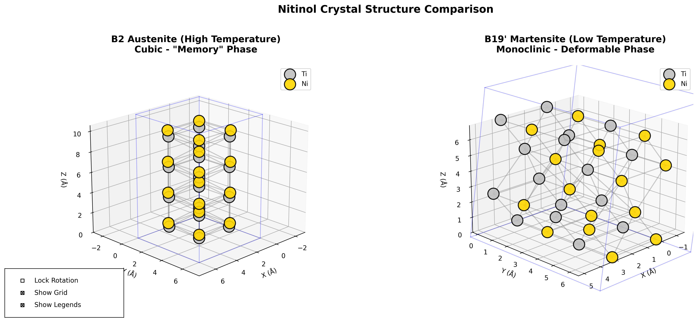

# Nitinol Phase Visualization for Kids - Interactive Crystal Structure Explorer

[](LICENSE)
[](https://www.python.org/downloads/)
[](https://wiki.fysik.dtu.dk/ase/)

> **Educational nitinol crystal structure visualization tool designed for kids, students, and science enthusiasts to explore shape-memory alloy experiments through interactive 3D atomic models.**



## What is Nitinol?

**Nitinol** (Nickel-Titanium) is a fascinating **shape-memory alloy** that "remembers" its original shape! When you deform it at low temperature and then heat it up, it magically returns to its original form. This amazing property makes it perfect for:

- **Science experiments for kids** - Watch metal springs bounce back to shape!
- **Medical devices** - Self-expanding stents and orthodontic wires
- **Robotics** - Artificial muscles and actuators
- **Aerospace** - Deployable structures and adaptive wings

### The Science Behind the Magic

Nitinol's shape-memory effect comes from a **phase transformation** between two crystal structures:

1. **B2 Austenite** (High Temperature) - Cubic "memory" phase that remembers the original shape
2. **B19' Martensite** (Low Temperature) - Monoclinic deformable phase that can be bent easily

This project visualizes these atomic structures in 3D to help kids and students understand what's happening at the atomic level during nitinol experiments!

## Features

### 🔬 Interactive 3D Visualization
- **Side-by-side comparison** of both crystal phases
- **Synchronized rotation** - Lock both structures to rotate together
- **Atom coloring** - Gold for nickel (Ni), silver for titanium (Ti)
- **Bond visualization** - See how atoms connect in 3D space
- **Unit cell display** - Understand crystal lattice structure

### 🎓 Educational Tools
- **Perfect for kids' science experiments** with nitinol wire
- **STEM education** - Teach materials science and chemistry
- **Adjustable parameters** - Change atom counts, viewing angles, and bond distances
- **Export high-quality images** - For science fair presentations and reports

### 🎮 User Controls
- **Lock Rotation** - Synchronize rotation of both crystal structures
- **Show/Hide Grid** - Toggle 3D coordinate system
- **Show/Hide Legends** - Control atom type labels
- **Mouse rotation** - Click and drag to explore from any angle

## Quick Start

### Prerequisites

- Python 3.8 or higher
- pip package manager

### Installation

1. **Clone the repository:**
```bash
git clone https://github.com/kirillzubovsky/nitinol-phase-visualization.git
cd nitinol-phase-visualization
```

2. **Create a virtual environment:**
```bash
python3 -m venv venv
source venv/bin/activate  # On Windows: venv\Scripts\activate
```

3. **Install dependencies:**
```bash
pip install ase matplotlib numpy
```

### Running the Visualization

#### Option 1: Quick Start Script
```bash
./start.sh
```

#### Option 2: Direct Python Execution
```bash
python compare_nitinol_phases.py
```

The interactive visualization window will open, and a high-resolution PNG image will be saved automatically!

## Usage Examples

### For Kids' Science Experiments

If you're doing a **nitinol wire experiment**, use this tool to:

1. **Before heating** - Show the B19' martensite structure (deformable)
2. **After heating** - Show the B2 austenite structure (memory phase)
3. **Compare side-by-side** - See the atomic transformation!

### Customizing the Visualization

Edit the `SHARED_PARAMS` dictionary in `compare_nitinol_phases.py`:

```python
SHARED_PARAMS = {
    'num_atoms': 32,              # Total atom count
    'repetitions_b2': (2, 2, 4),  # B2 unit cell repetitions
    'repetitions_b19': (2, 2, 2), # B19' unit cell repetitions
    'initial_view': {
        'elev': 20,               # Elevation angle
        'azim': 45                # Azimuth angle
    },
    'bond_distance': 3.2,         # Max bond distance (Angstroms)
    'atom_size': 300,             # Sphere size
    'bond_width': 1.5,            # Line thickness
    'bond_alpha': 0.4             # Bond transparency
}
```

### Creating Cylindrical Nitinol Wire

Use `visualize_nitinol.py` to create wire-shaped structures:

```python
python visualize_nitinol.py
```

This creates a cylindrical nitinol wire in the ASE viewer, perfect for understanding how the crystal structure extends in 3D.

## Project Structure

```
nitinol-phase-visualization/
├── compare_nitinol_phases.py   # Main interactive comparison tool
├── visualize_nitinol.py        # Cylindrical wire visualization
├── start.sh                    # Quick start script
├── nitinol_phase_comparison.png # Generated output image
├── README.md                   # This file
├── LICENSE                     # MIT License
└── venv/                       # Python virtual environment
```

## Educational Resources

### Understanding the Crystal Structures

**B2 Austenite (Cubic):**
- Simple body-centered cubic structure
- Ti atoms at corners, Ni at body center
- Lattice parameter: ~3.015 Å
- Stable at high temperature (>~80°C)

**B19' Martensite (Monoclinic):**
- Complex monoclinic structure
- Lattice parameters: a≈2.89Å, b≈4.12Å, c≈4.62Å
- Monoclinic angle β≈96.8°
- Stable at low temperature (<~50°C)

### Science Experiment Ideas

1. **Shape Memory Effect**
   - Bend nitinol wire when cold
   - Heat with hot water or hair dryer
   - Watch it return to original shape!
   - Use this tool to explain the atomic transformation

2. **Superelasticity Demo**
   - Bend nitinol wire at room temperature
   - Release and watch it spring back
   - Show students the B2 structure that enables this

3. **Temperature Sensing**
   - Create nitinol actuators
   - Demonstrate phase transformation temperatures
   - Visualize what's happening at atomic scale

## Technical Details

### Dependencies

- **ASE (Atomic Simulation Environment)** - Crystal structure creation
- **Matplotlib** - 3D visualization and plotting
- **NumPy** - Numerical calculations

### Crystal Structure Calculations

The code accurately implements:
- B2 (CsCl-type) structure with proper lattice parameters
- B19' monoclinic structure with approximate atomic positions
- Periodic boundary conditions
- Nearest-neighbor bond calculations

### Performance

- Handles up to 100+ atoms efficiently
- Real-time 3D rotation
- High-resolution image export (300 DPI)

## Contributing

We welcome contributions! See [CONTRIBUTING.md](CONTRIBUTING.md) for guidelines.

**Ideas for contributions:**
- Add more phase transformations (R-phase, B19)
- Implement temperature-dependent animations
- Create educational game modes for kids
- Add VR/AR support for immersive learning
- Develop lesson plans for teachers

## FAQ

**Q: Can I use this for my science fair project?**
A: Absolutely! This tool is perfect for science fair presentations about nitinol, shape-memory alloys, or materials science.

**Q: Is this suitable for elementary school kids?**
A: Yes! The visual nature makes it great for kids 8+ to understand atomic structures. The interactive controls make it engaging and fun.

**Q: Can I modify the code for my experiment?**
A: Yes! The code is open-source (MIT License). Modify the `SHARED_PARAMS` to customize visualizations.

**Q: Where can I buy nitinol wire for experiments?**
A: Search for "nitinol shape memory wire" on educational science supply websites or online marketplaces.

**Q: Does this simulate the actual phase transformation?**
A: This tool shows static structures of both phases. It doesn't simulate the dynamic transformation, but clearly shows the before/after atomic arrangements.

## License

This project is licensed under the MIT License - see the [LICENSE](LICENSE) file for details.

## Acknowledgments

- Built with [ASE (Atomic Simulation Environment)](https://wiki.fysik.dtu.dk/ase/)
- Crystal structure data from materials science literature
- Inspired by the amazing shape-memory properties of nitinol

## Keywords

nitinol visualization, shape memory alloy, kids science experiment, crystal structure, phase transformation, B2 austenite, B19 martensite, nickel titanium, materials science education, STEM learning, atomic structure, 3D molecular visualization, interactive chemistry, nitinol wire, shape memory effect, superelasticity, smart materials, educational software, Python visualization, ASE atomic simulation

---

**Made with ❤️ for curious minds exploring the atomic world of shape-memory alloys!**

*Star ⭐ this project if you found it helpful for your nitinol experiments!*
